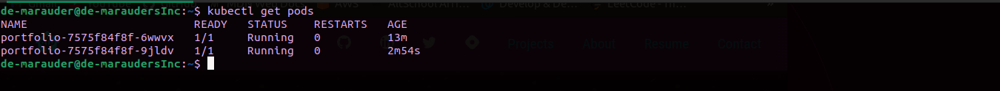
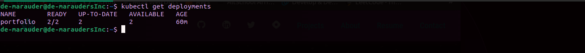
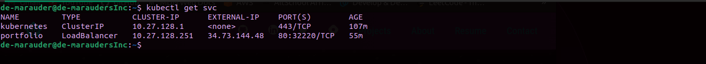
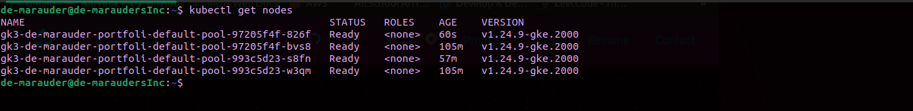
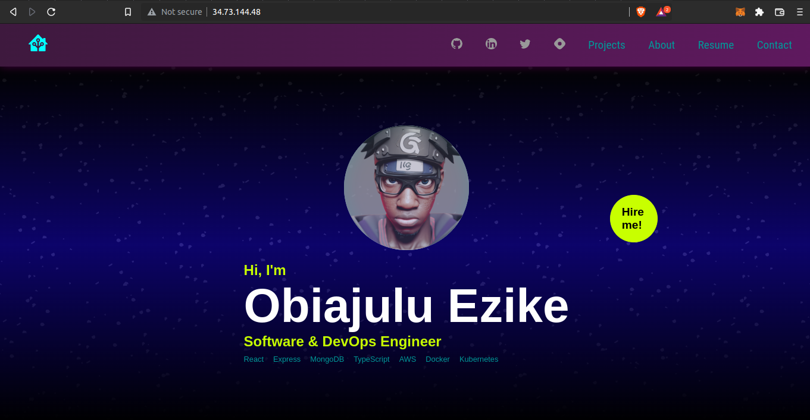

# How I Hosted My Portfolio Site Using Google Kubernetes Engine (GKE)

This article describes how to use GKE to deploy a highly available application

## Prerequisites
- gcloud-sdk / CLI (You can set it up using the instructions [here](https://cloud.google.com/sdk/docs/install-sdk#linux))
- kubectl
  
# Procedure
1. Create a GKE cluster using the gcloud CLI tool
   ```bash
   gcloud container clusters create-auto helloworld-gke \
  --region $REGION
   ```

2. Confirm cluster creation
  ```bash
  kubectl get nodes
  ```

3. Write a deployment configuration [like this](./deployment.yaml) and apply it to the cluster nodes
  ```bash
  kubectl apply -f deployment.yaml
  ```

4. Confirm deployment
   ```bash
   kubectl get deployments
   kubectl get pods
   ```



5. Write a service configuration [like this](./service.yaml) and apply it to the cluster nodes
  ```bash
  kubectl apply -f service.yaml
  ```

6. Confirm service application
   ```bash
   kubectl get svc
   kubectl get nodes
   ```



7. View deployed application
   ```bash
   curl <NodeIP>:<NodePort>
   #or
   curl <LoadBalancerIP>
   ```

# Results



# Troubleshooting
1. Make sure the port forwarding and mapping are done correctly with respect to the image being used.
2. Make sure the nodes resources (vCPU and memory) are enough to run your deployments