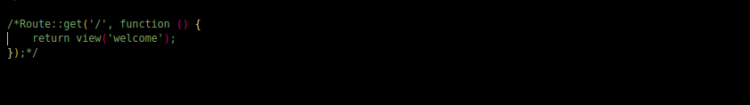
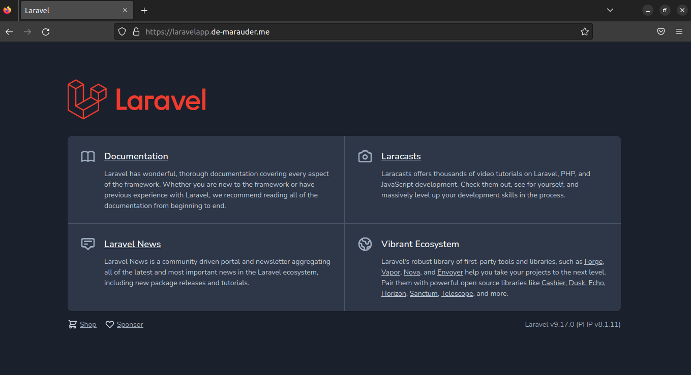

# How to deploy a laravel application with MySQL database on a debian 11 server

In this article, I will be detailing how to deploy a laravel application on an aws ec2 instance running a debian OS. The steps however should work on other distros as well. The server configuration will be done using ansible
The project we shall deploy can be found [here](https://github.com/f1amy/laravel-realworld-example-app)

> Preview of deployed app ==> https://laravelapp.de-marauder.me/

## Prerequisites
To follow along with this tutorial, you will need the following:
- A server or VM running debian or ubuntu
- A host/master computer preferrably running linux
- Ansible
- git
- Basic system administration skills
- A valid domain name already pointing to your server's IP (You could make use of Elastic IP to generate a static IP)

# Procedure

Note all these configurations should be done in your server locally or on a cloud provider

## Step 1

Update package repository
```sh
sudo apt update
```

## Step 2

Install server requirements
```sh
sudo apt install git npm apache2 acl libaugeas0 python3-venv
```

## Step 3

Installing php dependencies
```sh
sudo apt install lsb-release ca-certificates apt-transport-https software-properties-common gnupg2
```

## Step 4
Add php repository to package sources and
Import php repository key
```sh
echo "deb https://packages.sury.org/php/ $(lsb_release -sc) main" | sudo tee /etc/apt/sources.list.d/sury-php.list

wget -qO - https://packages.sury.org/php/apt.gpg | sudo apt-key add -

sudo apt update
```

## Step 5

Install php and php extensions

```sh
sudo apt install php

sudo apt install php-cli php-fpm php-json php-mysql php-zip php-gd php-mbstring php-curl php-xml php-bcmath php-json
```

## Step 6

Setup Database
- Reset root password
- Switch to unix socket authentication
- Remove anonymous users
- Allow root user to login remotely
- Remove test database
- Create new database for our app
- Reload privilege tables

_Make sure to switch to root user first_


## Step 7

Add apache configuration to sites-available using a text editor of your choice

```sh
vi /etc/apache2/sites-available/<site-name>.conf
```
or
```sh
emacs /etc/apache2/sites-available/<site-name>.conf
```
or
```sh
nano /etc/apache2/sites-available/<site-name>.conf
```
Your conf file should look like this
```
<VirtualHost *:{{ http_port }}>
    ServerAdmin username@localhost
    ServerName {{ site-name }}
    ServerAlias www.{{ site-name }}
    DocumentRoot /var/www/{{ site-name }}/public
    ErrorLog ${APACHE_LOG_DIR}/error.log
    CustomLog ${APACHE_LOG_DIR}/access.log combined

    <Directory /var/www/{{ site-name }}>
          Options -Indexes
          AllowOverride all
          Require all granted
    </Directory>

    <IfModule mod_dir.c>
        DirectoryIndex index.php index.html index.cgi index.pl  index.xht>
    </IfModule>

</VirtualHost>
```

## Step 8

- Enable our site
- Disable Apache's default site
- Reload Apache
```sh
/usr/sbin/a2ensite <site-name>
/usr/sbin/a2dissite 000-default.conf

sudo systemctl reload apache2
```

## Step 9

Install certbot and generate certifcates to encrypt traffic through your domain (TLS/SSL). This will allow your site to be accessed by https protocol. Make sure to allow HTTPS traffic on port 443 on your instances' security group.

```sh
python3 -m venv /opt/certbot/

/opt/certbot/bin/pip install --upgrade pip

/opt/certbot/bin/pip install certbot certbot-apache

ln -s /opt/certbot/bin/certbot /usr/bin/certbot

certbot --apache -n -d <domain-name> -m <mail> --agree-tos

```

## Step 10

Clone laravel project from github and transfer all its contents to /var/www/<site-name>

```sh
cd /var/www/<site-name>
git clone git@github.com:f1amy/laravel-realworld-example-app.git

cp -R laravel-realworld-example-app/* .
rm -rf /var/www/<site-name>/laravel-realworld-example-app
```

## Step 11

Assign Permissions

```sh
sudo chown -R <server-user>:www-data /var/www/example.com/
find /var/www/<site-name>/ -type f -exec chmod 664 {} \;    
find /var/www/<site-name>/ -type d -exec chmod 775 {} \;
chgrp -R www-data storage bootstrap/cache
chmod -R ug+rwx storage bootstrap/cache
```

## Step 13

Download and run composer. Make sure to reference their docs [here](https://getcomposer.org/download/)

```sh
php -r "copy('https://getcomposer.org/installer', 'composer-setup.php');"
php -r "if (hash_file('sha384', 'composer-setup.php') === '55ce33d7678c5a611085589f1f3ddf8b3c52d662cd01d4ba75c0ee0459970c2200a51f492d557530c71c15d8dba01eae') { echo 'Installer verified'; } else { echo 'Installer corrupt'; unlink('composer-setup.php'); } echo PHP_EOL;"
php composer-setup.php
php -r "unlink('composer-setup.php');"
```

## Step 14

Install project dependencies and run project

```sh
cd /var/www/<site-name>
composer install
composer update
npm install
npm run prod
```

## Step 15

Expose routes in application by uncommenting this section of the /var/www/<site-name>/routes/web.php file



## Step 16

Generate an app key for your application using a site like [this](https://generate-random.org/laravel-key-generator) and add it to a .env file at your root directory

.env
```
APP_NAME="Laravel Realworld Example App"
APP_ENV=local
APP_KEY=<generated key>
APP_DEBUG=true
APP_URL=<domain name>
APP_PORT=3000

DB_CONNECTION=mysql
DB_HOST=localhost
DB_PORT=3306
DB_DATABASE={{ db_name }}
DB_USERNAME={{ db_user }}
DB_PASSWORD={{ db_password }}

LOG_CHANNEL=stack
LOG_DEPRECATIONS_CHANNEL=null
LOG_LEVEL=debug
```
then, run
```sh
cd /var/www/<site-name>
php artisan key:generate
php artisan config:cache
php artisan migrate:fresh
php artisan migrate --seed
```

## Step 17

Check your server using it's public IP <http://IP-address>



## Step 18

You could decide to configure your DNS on your machine. For this, open the hosts file and add your preferred domain name. **Note** this wont be accesible on the internet.
```sh

sudo nano /etc/hosts

```
add a line like
```
127.0.0.1  <Your domain>
```
to map localhost to your preferred domain name.

## Step 19

Since we are on an EC2 instance you could curl the domain name you just setup to test it.
```sh
curl <domain name>
```

Alternatively, you could obtain a domain name from any provider of your choice. Then map it to the public IP address of your EC2 instance. To make things more convenient, you could also generate  a static IP address using AWS Elastic IP and then attach your EC2 instance to it. 

You could also opt to make use of AWS route53 for DNS management.

# Automation

To automate this process, you can reference the ansible playbook [with bash script](./deploy-LAPP-bash-playbook.yml) or [without bash script](./deploy-LAPP-playbook.yml)

