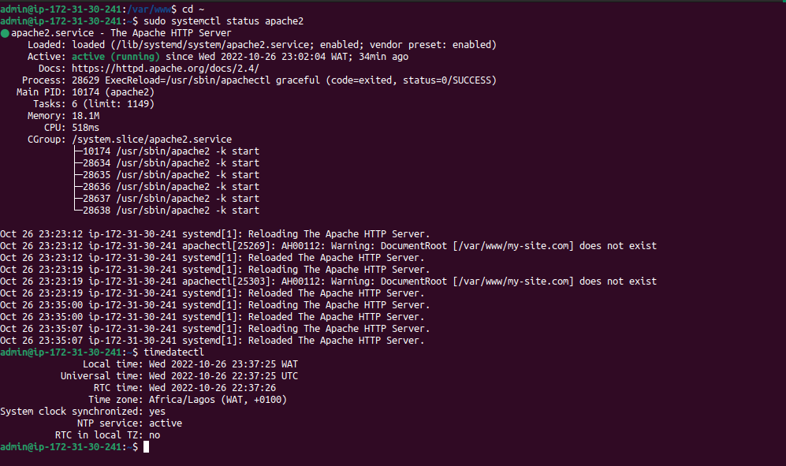
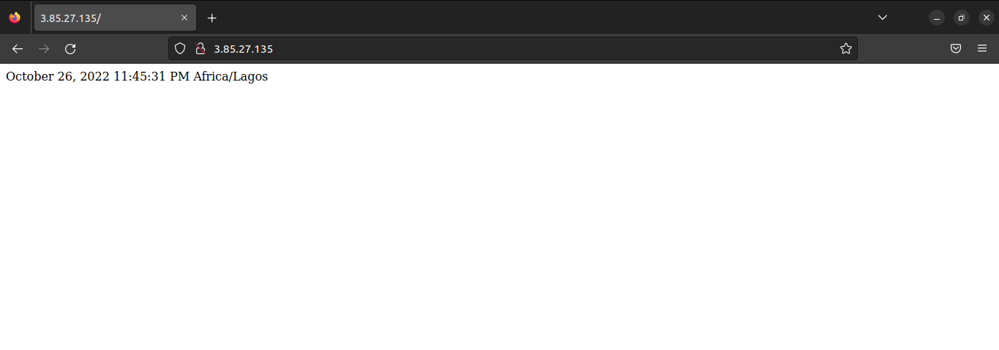

# LAMP on Ubuntu >=18.04

This playbook will install a LAMP environment (**L**inux, **A**pache, **M**ySQL and **P**HP) on an Ubuntu >=18.04 machine. A virtualhost will be created with the options specified in the `vars/default.yml` variable file.

## Settings

- `db_root_password`: the password for the MySQL root account.
- `app_user`: a remote non-root user on the Ansible host that will own the application files.
- `http_host`: your domain name.
- `http_conf`: the name of the configuration file that will be created within Apache.
- `http_port`: HTTP port, default is 80.
- `disable_default`: whether or not to disable the default Apache website. When set to true, your new virtualhost should be used as default website. Default is true.


## Running this Playbook

Quickstart guide for those already familiar with Ansible:

### 1. Customize Options

```shell
nano vars/default.yml
```

```yml
---
mysql_root_password: "db_root_password"
app_user: "username"
http_host: "your_domain"
http_conf: "your_domain.conf"
http_port: "80"
disable_default: true
```

### 2. Run the Playbook

```command
ansible-playbook -l [target] -i [inventory file] -u [remote user] playbook.yml
```

### 3. Enter server to verify Apache status



### 3. Check output

